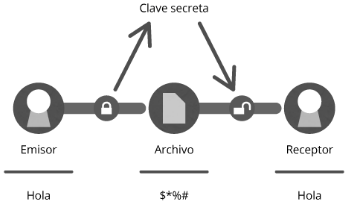
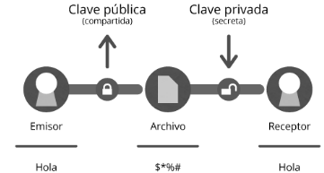

GPG: cifra, firma y envía datos
================================

**GPG** GnuPG (la versión libre de PGP - Pretty Good Privacy), con el que cifraremos cualquier tipo de archivo que podremos mandar “libremente” con cierta seguridad de que nadie lo podrá leer.

¿Qué es GnuPG?
++++++++++++++

GPG (GNU Privacy Guard), que es un derivado libre de PGP y su utilidad es la de cifrar y firmar digitalmente, siendo además multiplataforma, viene incorporado en algunos sistemas Linux.

Anillo de claves
+++++++++++++++++

GPG tiene un repositorio de claves (anillo de claves) donde guarda todas las que tenemos almacenadas en nuestro sistema, ya sean privadas o públicas (con la clave pública cifraremos un mensaje que solo podrá descifrar el que posee la clave privada).

Cuando veamos un anillo de claves debemos de recordar que **pub** hace referencia a la clave pública y **sub** hace referencia a la privada.

Servidores de claves
+++++++++++++++++++++

Para que nos cifren un mensaje tenemos que compartir la clave pública de nuestro par de claves, y como es un poco engorroso difundir una clave a muchas personas existen los servidores de claves PGP (compatibles con GPG), donde se puede subir claves públicas.
Unos ejemplos de servidores son estos: pgp.rediris.es (español, aunque falla algunas veces) o pgp.mit.edu (americano, del MIT)

Cifrado simétrico
+++++++++++++++++

La criptografía simétrica - también llamada criptografía de clave secreta o criptografía de una clave-. Es un método criptográfico en el que usa una misma clave para cifrar y descifrar mensajes. Tanto el emisor como el receptor deben ponerse de acuerdo de antemano sobre la clave a usar. Una vez que el emisor y el receptor tienen acceso a esta clave, el emisor cifra el mensaje usando la clave, y, el receptor descifra el mensaje, utilizando la misma clave.

Para empezar la prueba tenemos que tener un archivo de cualquier tipo e introducir en la terminal de Linux el comando gpg con el parámetro -c para cifrar y -d para descifrar.::

	$ echo "Este es un archivo para probar GPG" > miarchivo.txt
	$ gpg -c miarchivo.txt 
	Enter passphrase

	Passphrase: 
	Please re-enter this passphrase
	Passphrase: 

Verificamos el archivo creado con gpg::

	$ ls
	miarchivo.txt miarchivo.txt.gpg
	$ cat miarchivo-txt.gpg
	  ���c���s���O\̙�"���Ff���H�0
	$ file miarchivo-txt
	miarchivo.txt: ASCII text
	$ file miarchivo.txt.gpg 
	miarchivo-txt.gpg: GPG symmetrically encrypted data (AES cipher)

Ahora el archivo lo podemos enviar a otro equipo con la seguridad que esta encriptado y desde ese otro equipo podremos leer el contenido siempre y cuando tengamos el conocimiento de cual es la clave.::

	$ gpg -d miarchivo.txt.gpg 
	gpg: AES encrypted data
	Enter passphrase

	Passphrase: 
	gpg: encrypted with 1 passphrase

	Hola este es un archivo para verificar la Criptografia

Cifrado asimétrico
+++++++++++++++++++

La criptografía asimétrica - también llamada criptografía de clave pública o criptografía de dos claves. La criptografía asimétrica se basa en el uso de dos claves: 
la pública (que se podrá difundir sin ningún problema a todas las personas que necesiten mandarte algo cifrado) y la privada (que no debe de ser revelada nunca). 

Si queremos que otras personas nos manden un archivo cifrado, ellos deben tener nuestra clave pública (que está vinculada a la privada) y nos podrán mandar de forma confidencial el archivo que solo nosotros podremos descifrar con la clave privada.

**Generar las claves**

Para poder cifrar asimétricamente primero tenemos que crear la pareja de claves (pública y privada) con el comando gpg --gen-key.::

	$ gpg --gen-key
	gpg (GnuPG) 2.1.18; Copyright (C) 2017 Free Software Foundation, Inc.
	This is free software: you are free to change and redistribute it.
	There is NO WARRANTY, to the extent permitted by law.

	Note: Use "gpg --full-generate-key" for a full featured key generation dialog.

	GnuPG needs to construct a user ID to identify your key.

	Real name: Carlos Gomez
	Email address: cgomeznt@gmail.com
	You selected this USER-ID:
	    "Carlos Gomez <cgomeznt@gmail.com>"

	Change (N)ame, (E)mail, or (O)kay/(Q)uit? O
	We need to generate a lot of random bytes. It is a good idea to perform
	some other action (type on the keyboard, move the mouse, utilize the
	disks) during the prime generation; this gives the random number
	generator a better chance to gain enough entropy.
	Please enter the passphrase to
	protect your new key
	Passphrase: 
	Repeat: 
	We need to generate a lot of random bytes. It is a good idea to perform
	some other action (type on the keyboard, move the mouse, utilize the
	disks) during the prime generation; this gives the random number
	generator a better chance to gain enough entropy.
	gpg: key 0E10642DA44DDE86 marked as ultimately trusted
	gpg: directory '/home/cgomez/.gnupg/openpgp-revocs.d' created
	gpg: revocation certificate stored as '/home/cgomez/.gnupg/openpgp-revocs.d/416B2447FDF6B692580E3E1B0E10642DA44DDE86.rev'
	public and secret key created and signed.

	pub   rsa2048 2019-01-19 [SC] [expires: 2021-01-18]
	      416B2447FDF6B692580E3E1B0E10642DA44DDE86
	      416B2447FDF6B692580E3E1B0E10642DA44DDE86
	uid                      Carlos Gomez <cgomeznt@gmail.com>
	sub   rsa2048 2019-01-19 [E] [expires: 2021-01-18]

Tras generar las claves podemos verlas con el comando gpg -k que nos muestra nuestro anillo de claves, lo importante de este paso es que veremos la identificación de cada una, que es necesaria para poderlas exportar y enviar.::

	$ gpg -k
	gpg: checking the trustdb
	gpg: marginals needed: 3  completes needed: 1  trust model: pgp
	gpg: depth: 0  valid:   1  signed:   0  trust: 0-, 0q, 0n, 0m, 0f, 1u
	gpg: next trustdb check due at 2021-01-18
	/home/cgomez/.gnupg/pubring.kbx
	-------------------------------
	pub   rsa2048 2019-01-19 [SC] [expires: 2021-01-18]
	      416B2447FDF6B692580E3E1B0E10642DA44DDE86
	uid           [ultimate] Carlos Gomez <cgomeznt@gmail.com>
	sub   rsa2048 2019-01-19 [E] [expires: 2021-01-18]

**Exportar y enviar la clave privada**

El objetivo de esta pareja de claves es que cualquiera nos pueda mandar un archivo cifrado que solo veremos nosotros y esto se hace difundiendo la clave pública que acabamos de crear (la pública, nunca la privada), para exportarla en un archivo usaremos el comando gpg -output [archivo destino] --export [ID de a clave pública] (la clave pública generada antes tiene la ID 416B2447FDF6B692580E3E1B0E10642DA44DDE86).::

	$ gpg --output cgomezntPUB.gpg --export 416B2447FDF6B692580E3E1B0E10642DA44DDE86
	$ ls cgomezntPUB.gpg 
	cgomezntPUB.gpg
	$ file cgomezntPUB.gpg 
	cgomezntPUB.gpg: GPG key public ring, created Sat Jan 19 01:21:47 2019

Este archivo ahora se puede difundir por el medio que queramos, tenemos que tener en cuenta que el único problema de seguridad que habría en difundir la clave es que alguien se hiciese pasar por otro al mandarnos un mensaje, algo que pasaría igual si no estuviese cifrado, por eso el que nos envíe algo lo debería de firmar (si fuese pertinente).

**Subir una clave pública a un servidor de claves**

Los servidores de claves suelen ser de acceso público (al no haber mucho problema por difundir una clave pública) y en este caso subiremos una clave a los servidores del MIT (pgp.mit.edu) usando el comando gpg --send-keys --keyserver [Dirección del servidor] [ID de la clave pública] (al igual que antes la ID es 416B2447FDF6B692580E3E1B0E10642DA44DDE86).

Debe tener instalado este paquete::

	# apt-get install -y dirmngr

Ahora si continuamos, si no tenemos un keyserver lo buscamos en Google y continuamos con::

	$ gpg --keyserver http://keyserver.mattrude.com --send-key 416B2447FDF6B692580E3E1B0E10642DA44DDE86
	gpg: sending key 0E10642DA44DDE86 to http://keyserver.mattrude.com

A partir de este momento la clave estará accesible desde este servidor específico.

**Importar la clave desde el archivo**

Para poder usar la clave pública para cifrar o comprobar la identidad del remitente tenemos que importar previamente la clave, desde un archivo debemos de usar el comando gpg --import [Archivo de la clave pública] (el que hemos descargado anteriormente).::

	$ gpg --import cgomezntPUB.gpg 
	gpg: key 0E10642DA44DDE86: "Carlos Gomez <cgomeznt@gmail.com>" imported
	gpg: Total number processed: 1
	gpg:              unchanged: 1

**Importar la clave desde servidor de claves**

Para poder usar la clave pública para cifrar o comprobar la identidad del remitente tenemos que importar previamente la clave, ddebemos de usar el comando gpg --keyserver [Servidor de claves] (el que hemos descargado anteriormente) --recv-key [ID de la clave pub].::

	$ gpg --keyserver http://keyserver.mattrude.com --recv-key 416B2447FDF6B692580E3E1B0E10642DA44DDE86
	gpg: key 0E10642DA44DDE86: public key "Carlos Gomez <cgomeznt@gmail.com>" imported
	gpg: Total number processed: 1
	gpg:               imported: 1

Consultamos nuestro repositorio local::

	$ gpg -k
	/home/cgomez/.gnupg/pubring.kbx
	-------------------------------
	pub   rsa2048 2019-01-19 [SC] [expires: 2021-01-18]
	      416B2447FDF6B692580E3E1B0E10642DA44DDE86
	uid           [ unknown] Carlos Gomez <cgomeznt@gmail.com>
	sub   rsa2048 2019-01-19 [E] [expires: 2021-01-18]

**Cifrar con la clave pública**

Ahora tenemos que pensar que hemos importado una clave pública, por ejemplo de nuestro jefe y tenemos que mandarle un documento, para cifrar el documento usaremos el comando gpg —encrypt —recipient [ID de la clave] [Archivo]::

	$ echo "Generando un archivo de prueba para encriptarlo" > documento.txt

	$ gpg --encrypt --recipient 416B2447FDF6B692580E3E1B0E10642DA44DDE86 documento.txt 
	gpg: BCE3CA90E30184A9: There is no assurance this key belongs to the named user
	sub  rsa2048/BCE3CA90E30184A9 2019-01-19 Carlos Gomez <cgomeznt@gmail.com>
	 Primary key fingerprint: 416B 2447 FDF6 B692 580E  3E1B 0E10 642D A44D DE86
	      Subkey fingerprint: 5BE7 3363 B857 95E3 634F  A0DE BCE3 CA90 E301 84A9

	It is NOT certain that the key belongs to the person named
	in the user ID.  If you *really* know what you are doing,
	you may answer the next question with yes.

	Use this key anyway? (y/N) y

	$ ls documento.txt* 
	documento.txt  documento.txt.gpg

	$ file documento.txt.gpg 
	documento.txt.gpg: PGP RSA encrypted session key - keyid: 90CAE3BC A98401E3 RSA (Encrypt or Sign) 2048b .

Y ya tenemos el archivo listo para mandarlo de forma segura.

**Descifrar un archivo con la clave privada**

Y ahora es el momento de descifrar con nuestra clave privada el documento tras recibirlo, con el comando gpg -d [Archivo] e introduciendo la contraseña que creamos para salvaguardar la clave privada.::

	$ gpg -d documento.txt.gpg 
	Please enter the passphrase to unlock the OpenPGP secret key:
	"Carlos Gomez <cgomeznt@gmail.com>"
	2048-bit RSA key, ID BCE3CA90E30184A9,
	created 2019-01-19 (main key ID 0E10642DA44DDE86).

	Passphrase: 
	gpg: encrypted with 2048-bit RSA key, ID BCE3CA90E30184A9, created 2019-01-19
	      "Carlos Gomez <cgomeznt@gmail.com>"
	Generando un archivo de prueba para encriptarlo

Si queremos especificar la salida debemos de usar el parámetro -o [Archivo de salida].

Firmar archivos
++++++++++++++++++

Una de las medidas de seguridad básicas al pasar un mensaje es asegurarnos que el emisor es quien dice ser, para asegurarnos de esto digitalmente existe la firma digital, en el artículo anterior expliqué como GPG usaba los hash para crear una firma simple, pero también podemos cifrarlo y a su vez firmarlo, que es lo que haremos con el comando gpg -u [ID de la clave privada] --output [Archivo resultante] --sign [Archivo para firmar] e introduciendo la contraseña de la clave privada.::

	$ echo "Archivo de prueba para firmar" > firmar.txt

	$ gpg --output firmar.txt.gpg --sign firmar.txt 

	$ ls  firmar.txt*
	firmar.txt  firmar.txt.gpg
	$ file firmar.txt.gpg 
	firmar.txt.gpg: data
	$ cat firmar.txt.gpg 
	��������'�����^��$��̢��"��������E��e�

**Verificar y descifrar un archivo firmado**

Cualquiera con la clave pública asociada a la que ha firmado el documento puede leerlo, de la misma forma que desciframos un archivo (gpg -d [Archivo]) o verificándolo únicamente con el comando gpg --verify [Archivo].::

	$ gpg --verify firmar.txt.gpg 
	gpg: Signature made vie 18 ene 2019 22:00:15 -04
	gpg:                using RSA key 416B2447FDF6B692580E3E1B0E10642DA44DDE86
	gpg: Good signature from "Carlos Gomez <cgomeznt@gmail.com>" [ultimate]

Y el resultado es la información del remitente

