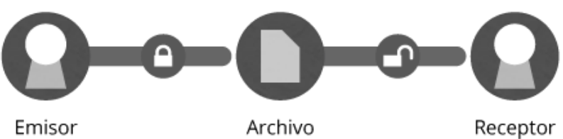

Tipos de criptografía
=====================

Existen diferentes tipos de criptografía. Vamos a centrarnos en 3 fundamentalmente: criptografía simétrica, criptografía asimétrica y criptografía hibrida.

Criptografía Simétrica
+++++++++++++++++++++++

La criptografía simétrica - también llamada criptografía de clave secreta o criptografía de una clave-. Es un método criptográfico en el que usa una misma clave para cifrar y descifrar mensajes. Tanto el emisor como el receptor deben ponerse de acuerdo de antemano sobre la clave a usar. Una vez que el emisor y el receptor tienen acceso a esta clave, el emisor cifra el mensaje usando la clave, y, el receptor descifra el mensaje, utilizando la misma clave.

Criptografía Asimétrica
+++++++++++++++++++++++++

La criptografía asimétrica - también llamada criptografía de clave pública o criptografía de dos claves. La criptografía asimétrica se basa en el uso de dos claves: 
la pública (que se podrá difundir sin ningún problema a todas las personas que necesiten mandarte algo cifrado) y la privada (que no debe de ser revelada nunca). 

Las dos claves pertenecen a la misma persona. Además, la criptografía asimétrica garantiza que ese par de claves sólo se pueda generar una sola vez. El remitente del mensaje utilizara la clave pública del destinatario y asi el destinatario sera el unico que podrá descifrar este mensaje con su llave privada, nadie salvo el destinatario puede descifrarlo.

La criptografía asimétrica como sistema de cifrado de clave pública se creó con la finalidad de evitar el problema del intercambio de claves en la criptografía simétrica. Con las claves públicas no es necesario que el emisor y el receptor del mensaje se pongan de acuerdo en la clave que se emplea. Existen dos tipos de criptografía de clave pública: el cifrado de clave pública y las firmas digitales. La mayor ventaja de la criptografía asimétrica es que la distribución de claves es más fácil y segura porque la clave pública es la que se distribuye, manteniéndose la clave privada en secreto y en exclusiva para el propietario, pero a su vez, este sistema tiene desventajas: el mensaje cifrado ocupa más espacio que el original, las claves son de mayor tamaño que las claves de la criptografía simétrica y para una misma longitud de clave y mensaje se necesita más tiempo de procesamiento.

Si queremos que otras personas nos manden un archivo cifrado, ellos deben tener nuestra clave pública (que está vinculada a la privada) y nos podrán mandar de forma confidencial el archivo que solo nosotros podremos descifrar con la clave privada.

Solo cifra una persona (con la clave pública) y la otra se limita a mirar el contenido (con la clave privada), por lo que la forma correcta de tener una comunicación bidireccional sería realizando este mismo proceso con dos pares de claves, o una por cada comunicador.

Otro propósito de este sistema es también el de poder firmar documentos, certificando que el emisor es quien dice ser, firmando con la clave privada y verificando la identidad con la clave pública.

Criptografía Híbrida
++++++++++++++++++++++++
La criptografía híbrida es un método criptográfico intermedia que utiliza tanto el cifrado simétrico como el asimétrico. Emplea el cifrado de clave pública para compartir una clave para el cifrado simétrico. El mensaje que se envía, se cifra usando su propia clave privada, luego el mensaje cifrado se envía al destinatario. Ya que compartir una clave simétrica no es seguro, ésta es diferente para cada sesión.

